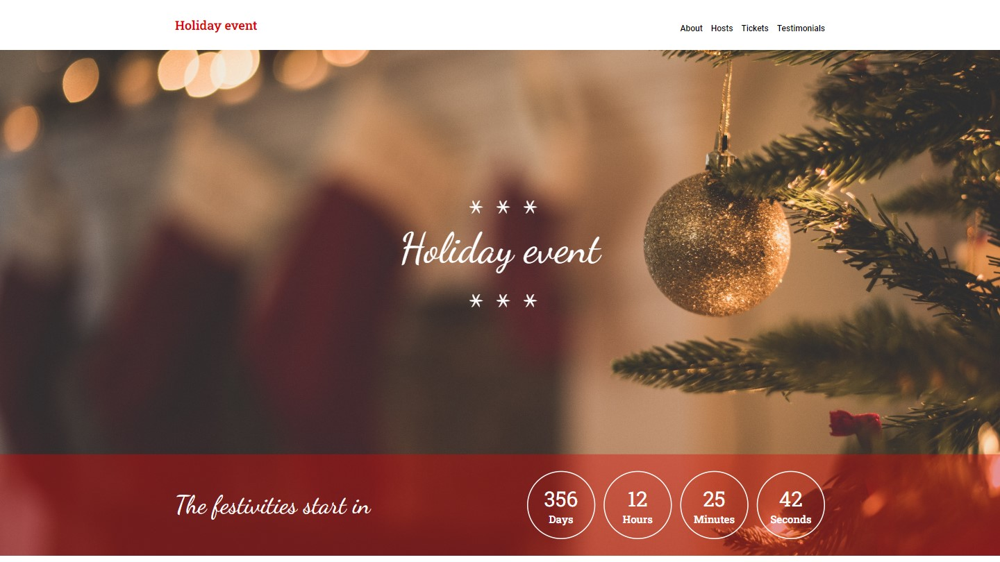

# Holiday event

## About
Holiday event is a template for building event sites related to the winter holidays.

## Demo
A demo of the template can be viewed over at https://kennethkodehode.github.io/holiday-event/

## Technologies used
* [React](https://reactjs.org/)
* [Typescript](https://www.typescriptlang.org/)
* [SASS/SCSS](https://sass-lang.com/)
* [BEM](https://getbem.com/)
* [FontAwesome](https://fontawesome.com/)

<!-- LICENSE -->
## License

Distributed under the MIT License. See `LICENSE` for more information.